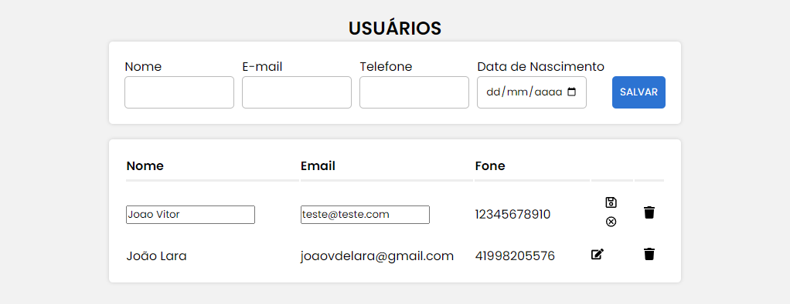

# CRUD-FullStack

## Descrição

O projeto CRUD-FullStack foi desenvolvido por João Lara e tem como intuito apresentar um projeto de CRUD com integração ao banco de dados.
 O projeto inclui a criação e implementação da API, bem como o desenvolvimento do frontend.

### Exemplo de Interface do Usuário:



## Instalação

Para instalar e executar o projeto, siga as instruções abaixo:

1. Clone o repositório do projeto:
   ```
   git clone https://github.com/joaovlara/CRUD-FullStack.git
   ```

2. Acesse o diretório do projeto:
   ```
   cd CRUD-FullStack
   ```

3. Instale as dependências do lado do cliente:
   ```
   cd client
   yarn install
   ```

4. Execute o projeto:
   ```
   yarn start
   ```

## Uso

O CRUD é um conjunto de operações básicas usadas em sistemas de banco de dados e aplicativos para gerenciar dados. As quatro operações são:

1. **Create (Criar)**: Adicionar novos dados.
2. **Read (Ler)**: Recuperar dados existentes.
3. **Update (Atualizar)**: Modificar dados existentes.
4. **Delete (Excluir)**: Remover dados existentes.

Essas operações formam a base para a manipulação eficaz de dados em aplicativos e sistemas de software.

# Dependências do Projeto

## Frontend (client)

- **React**: Biblioteca JavaScript para criar interfaces de usuário.
- **React DOM**: Fornece métodos específicos para DOM para serem usados ​​em conjunto com o React.
- **React Icons**: Pacote de ícones para aplicativos React.
- **React Scripts**: Scripts para iniciar e construir aplicativos React.
- **Styled Components**: Biblioteca para escrever CSS em JavaScript.
- **Axios**: Cliente HTTP baseado em Promises para fazer requisições AJAX.
- **React Toastify**: Biblioteca para exibir notificações de forma fácil e customizável.
- **Testing Library**: Ferramentas para testar componentes React.

## Backend (API)

- **Express**: Framework web rápido, flexível e minimalista para Node.js.
- **Cors**: Middleware para habilitar o CORS (Cross-Origin Resource Sharing) em aplicativos Node.js.
- **MySQL**: Driver para interagir com bancos de dados MySQL.
- **Nodemon**: Utilitário que monitora alterações no código fonte e reinicia automaticamente o servidor Node.js durante o desenvolvimento.

## Autor

[João Lara](https://www.linkedin.com/in/seu-perfil-do-linkedin/)

## Contato

Se você tiver alguma dúvida ou sugestão sobre o projeto, sinta-se à vontade para entrar em contato comigo em [joaovdelara@gmail.com](joaovdelara@gmail.com) ou através do meu [LinkedIn](https://www.linkedin.com/in/seu-perfil-do-linkedin/).

## Status do Projeto

Este projeto está atualmente em aperfeiçoamento.

---
